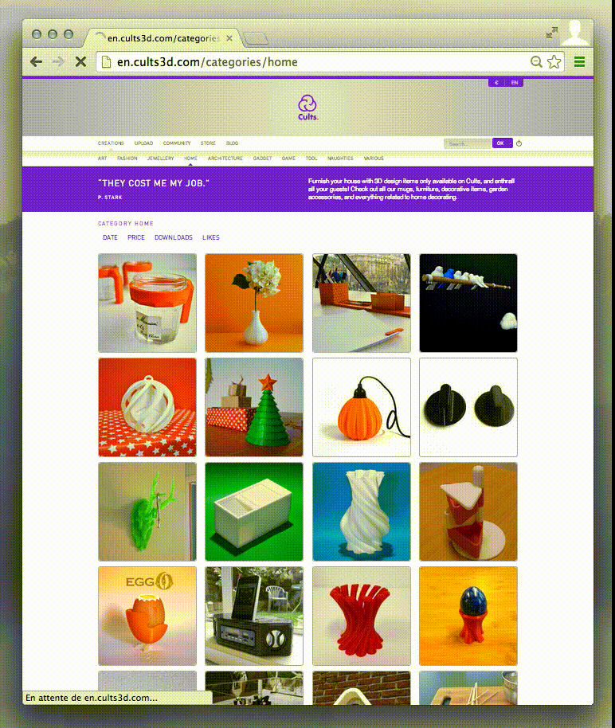

CarrierWave Color
=================

Add the dominant color of an image to your database whenever you upload it
with the CarrierWave gem on your Rails app.

This can be used to show the image's background color while it is loading
or to index images for a "search by color" feature.

Installation
------------

Add the following lines to your application's Gemfile:

```ruby
# Detect the dominant color of images on upload
gem "carrierwave-color"
```

And then call:

```sh
$ bundle
```

Add a processor to your uploader
--------------------------------

In your uploader, include the module and call the processor:

```ruby
class PhotoUploader < CarrierWave::Uploader::Base
  include CarrierWave::Color

  process :store_dominant_color

  # …
end
```

Add a dominant color attribute
------------------------------

To store the color, you need an attribute on the Rails model where you attach
your uploader. Call it `{uploader}_dominant_color`.

For example if you have the following model:

```ruby
class Article
  mount_uploader :photo, PhotoUploader
end
```

Then you would need to add a `photo_dominant_color` column to the `articles`
table. You could create a migration by executing:

```sh
$ rails g migration AddPhotoDominantColorToArticles photo_dominant_color
$ rake db:migrate
```

Using your dominant color
-------------------------

An easy way of using your dominant colors is to put them as a background to your
image tags:

```erb
<%= image_tag(article.photo.url(:thumb), style: "background: #{article.photo_dominant_color}") %>
```

For example, on [cults3d](http://cults3d.com):



Resizing
--------

If you do any resizing or if you have several versions of your uploader,
store the color on the smallest so that processing goes faster. For example:

```ruby
# …
version :medium do
  process resize_to_fill: [200, 200]
end

version :thumb, from_version: :medium do
  process resize_to_fill: [42, 42]
  process :store_dominant_color
end
# …
```

Dominant color from a palette
-----------------------------

If you wish to find the dominant color from a selection of colors, you can use
the following processor with a `{uploader}_palette_color` field on your model:

```rb
process store_palette_color: ['ff0000', '00ff00', '0000ff']
```


Contributing
------------

1. Fork it ( https://github.com/sunny/carrierwave-color/fork )
2. Create your feature branch (`git checkout -b my-new-feature`)
4. Launch specs (`bundle exec rspec`)
4. Commit your changes (`git commit -am 'Add some feature'`)
5. Push to the branch (`git push origin my-new-feature`)
6. Create a new Pull Request
